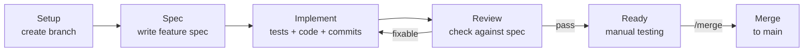
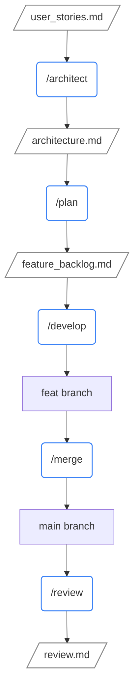

# robodev

Structured AI-assisted development. You design, AI delivers.

Define what you want built. The agent writes the spec, implements it, commits, reviews, and merges — fully autonomous. You review the result on `main`; `git revert` if needed.

## Install

Run in your project directory:

```bash
curl -LsSf https://raw.githubusercontent.com/sjev/robodev/main/install.sh | sh
```

## Commands

| Command | Purpose |
|---|---|
| `/architect` | Create/update architecture from user stories |
| `/plan` | Break architecture into a prioritized feature backlog |
| `/develop <description>` | Autopilot: spec → implement → commit → review (stops for manual testing) |
| `/merge <NNN-slug>` | Merge reviewed feature branch to main |
| `/commit` | Ad-hoc atomic conventional commits |
| `/review` | Periodic codebase audit (5 KPIs) |

## How `/develop` works

```
/develop "add CSV export for reports"
```



| Phase | What happens | Model |
|---|---|---|
| **Setup** | Create `feat/<slug>` branch | Opus |
| **Spec** | Write lightweight feature spec, flag assumptions | Opus |
| **Implement** | Write tests, production code, commit atomically | Sonnet |
| **Review** | Compare diff against spec, check tests pass | Opus |

After review passes, `/develop` stops so you can test the branch manually. Run `/merge <NNN-slug>` when ready.

## Workflow overview



## Development

Requires [uv](https://docs.astral.sh/uv/):

```bash
uv venv && source .venv/bin/activate
uv pip install -e ".[dev]"
invoke init      # clones agentskills repo, installs skills-ref
invoke validate  # validate all skills
```
