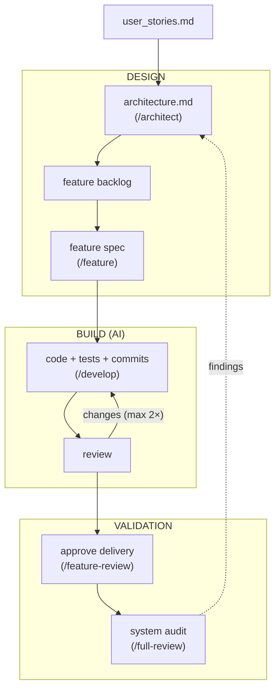
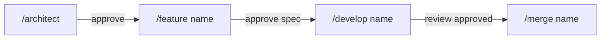
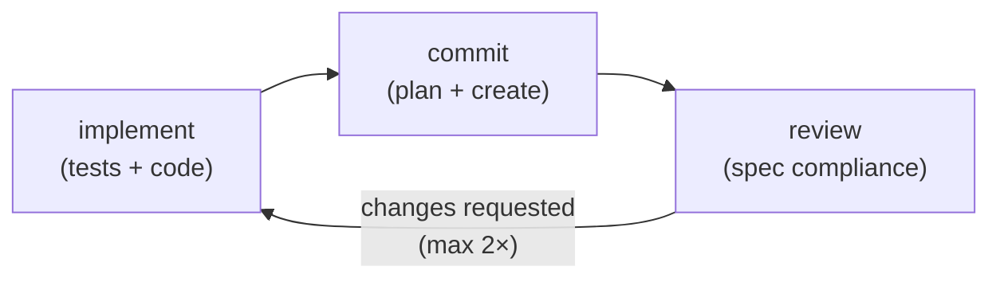

# robodev

Structured AI-assisted development. You design, AI delivers.

Software engineering solved the decompose-then-verify problem decades ago — break down on the left, verify on the right, gate each transition. AI can now own the lower layers (implementation and testing) while you keep the architecture. The feature spec is the interface between human intent and AI execution.

## The model




The architect decomposes at the top, hands off at the feature boundary, and AI handles everything below — surfacing back for merge approval.

## The workflow loop



## What `/develop` automates



On Claude Code, each phase runs as a separate subagent with model routing. On Copilot, the same phases run sequentially in one thread.

## Install

Run in your project directory:

```bash
curl -LsSf https://raw.githubusercontent.com/sjev/robodev/main/install.sh | sh
```

Create `docs/user_stories.md` with your requirements, then:

```bash
/architect            # design from user stories
/feature user-auth    # create branch + spec
/develop user-auth    # AI implements, tests, commits, reviews
/merge user-auth      # merge to main
```

## Commands

| Command | Purpose |
|---|---|
| `/architect` | Create/update architecture from user stories |
| `/feature <name>` | Branch + feature spec |
| `/develop <name>` | Implement, test, commit, review |
| `/merge <name>` | Merge approved feature to main |
| `/feature-review` | Optional standalone review |
| `/full-review` | Periodic codebase audit |

## Development

Requires [uv](https://docs.astral.sh/uv/):

```bash
uv venv && source .venv/bin/activate
uv pip install -e ".[dev]"
invoke init      # clones agentskills repo, installs skills-ref
invoke validate  # validate all skills
```
