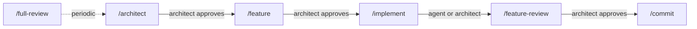

# Architecture: robodev

## Problem and context

Developers using AI coding agents (Claude Code, GitHub Copilot CLI) face two problems:
prompt and configuration drift between tools, and lack of a repeatable workflow
that keeps the human architect in control. This template provides a single-source-of-truth
setup so teams can switch between agents without duplicating instructions or losing
consistency.

Target audience: software architects who steer AI agents through a phased workflow
(spec → plan → implement → review) and want reviewable, atomic increments.

## Goals and non-goals

### Goals

1. **Single source of truth** — every skill and instruction is defined once using the
   [Agent Skills](https://agentskills.io) open standard, readable by any compatible tool.
2. **Phased workflow** — enforce spec → plan → implement → review gates so the architect
   validates at each stage.
3. **Tool-agnostic** — support Claude Code CLI and GitHub Copilot CLI today; adding
   another agent requires no new content — only Agent Skills compatibility.
4. **Minimal context** — keep project instructions and skills concise so agents
   get focused context without token bloat.

### Non-goals

- Building a framework or runtime — this is a static template of files and conventions.
- Automating CI/CD pipelines — out of scope; this covers the local dev workflow only.
- Prescribing a tech stack for target projects — the template is language-agnostic.

## Skills, not commands

This template uses **skills** (`.claude/skills/<name>/SKILL.md`), not legacy commands
(`.claude/commands/<name>.md`). The distinction matters:

| Aspect | Commands (legacy) | Skills (adopted) |
|---|---|---|
| Format | Single `.md` file | Directory with `SKILL.md` + supporting files |
| Standard | Claude Code proprietary | [Agent Skills](https://agentskills.io) open standard |
| Cross-tool | Requires symlinks per tool | Native discovery by any compatible agent |
| Invocation control | Always user-invoked | Configurable: user-only, agent-only, or both |
| Subagent support | No | `context: fork` runs in isolated subagent |
| Supporting files | No | Templates, scripts, examples alongside `SKILL.md` |

Skills follow the Agent Skills open standard — maintained by Anthropic, adopted by
GitHub Copilot and other tools. Both Claude Code and Copilot CLI discover skills in
`.claude/skills/` natively, so **no symlinks are needed for skills**.

## Repository structure

```
robodev/
├── CLAUDE.md                                    # ① Project instructions (canonical)
├── .claude/
│   └── skills/                                  # ② Agent Skills (open standard)
│       ├── architect/
│       │   └── SKILL.md
│       ├── feature/
│       │   ├── SKILL.md
│       │   └── template.md                      #    Feature doc template
│       ├── implement/
│       │   └── SKILL.md
│       ├── feature-review/
│       │   └── SKILL.md
│       ├── full-review/
│       │   └── SKILL.md
│       └── commit/
│           └── SKILL.md
├── .github/
│   └── copilot-instructions.md  → ../CLAUDE.md  # ③ Symlink (only one needed)
├── docs/
│   ├── architecture.md                          # This document
│   ├── features/                                # Feature design docs (one per feature)
│   └── internal/
│       └── user_stories.md                      # Requirements
└── README.md
```

### Key directories

| Directory | Purpose | Consumed by |
|---|---|---|
| `.claude/skills/` | Workflow skills (Agent Skills standard) | Claude Code, Copilot CLI — both discover natively |
| `docs/features/` | Feature design documents | Agents during `/implement` |
| `docs/internal/` | Requirements, user stories | Agents during `/architect` and `/feature` |

## Shared content strategy (DRY)

### Project instructions — symlink

| Tool | File read | Strategy |
|---|---|---|
| Claude Code | `CLAUDE.md` | Canonical — edit here |
| Copilot CLI / VS Code | `.github/copilot-instructions.md` | Symlink → `../CLAUDE.md` |

Both serve the same purpose: always-on project context loaded at session start.
This is the only symlink required.

```bash
mkdir -p .github
ln -s ../CLAUDE.md .github/copilot-instructions.md
```

### Skills — no symlinks needed

Skills live in `.claude/skills/` following the Agent Skills open standard. Both Claude
Code and Copilot CLI discover them from this location. No duplication, no symlinks.

Each skill is a directory with at minimum a `SKILL.md`. Supporting files (templates,
scripts, examples) live alongside it and are loaded on demand:

```
feature/
├── SKILL.md           # Main instructions (required)
├── template.md        # Feature doc template Claude fills in
└── examples/
    └── sample.md      # Example output showing expected format
```

## Skill inventory

Six skills cover the full development cycle. Each maps to a phase the architect
controls.

| Skill | Purpose | Invocation | Context |
|---|---|---|---|
| `/architect` | Create or update `docs/architecture.md` from user stories | User-only | Inline — needs Q&A with architect |
| `/feature` | Design a single feature into `docs/features/<name>.md` | User-only | Inline — needs Q&A with architect |
| `/implement` | Implement a feature design as code + tests | User-only | Inline — needs iterative approval |
| `/feature-review` | Review current branch diff vs `main` | Both | Fork (`Explore`) — read-only, no side effects |
| `/full-review` | Audit full codebase, score on KPIs | Both | Fork (`Explore`) — read-only analysis |
| `/commit` | Stage and commit changes with conventional messages | User-only | Inline — needs approval |

### Invocation control

Skills that change code or history require explicit invocation (`disable-model-invocation: true`).
Review skills are available to both user and agent — the agent may proactively suggest
a review after implementation, which supports the cross-agent review pattern.

### Subagent execution

Review skills run in a forked `Explore` subagent. This isolates read-only analysis
from the main conversation, prevents context pollution, and enables the cross-agent
review pattern (different model/context than the implementing agent).

### Frontmatter conventions

All skills in this template use these frontmatter fields from the Agent Skills standard:

```yaml
---
name: skill-name                     # Required: lowercase, hyphens only
description: What and when           # Required: max 1024 chars
argument-hint: [files or context]    # Optional: autocomplete hint
disable-model-invocation: true       # Optional: user-only invocation
context: fork                        # Optional: run in subagent
agent: Explore                       # Optional: subagent type
allowed-tools: Read Grep Glob        # Optional: tool restrictions
---
```

## Tool configuration

### Claude Code CLI

| Concept | Location | Notes |
|---|---|---|
| Project instructions | `CLAUDE.md` | Auto-loaded every session |
| Skills | `.claude/skills/<name>/SKILL.md` | Invoked as `/skill-name` |
| Settings (shared) | `.claude/settings.json` | Tool permissions, model preferences |
| Settings (personal) | `.claude/settings.local.json` | Git-ignored; per-developer overrides |

### GitHub Copilot CLI

| Concept | Location | Notes |
|---|---|---|
| Project instructions | `.github/copilot-instructions.md` | Symlink to `CLAUDE.md` |
| Skills | `.claude/skills/<name>/SKILL.md` | Discovered natively via Agent Skills standard |
| Path-scoped rules | `.github/instructions/*.instructions.md` | Optional; for language-specific guidance |

## Development cycle

The architect drives a repeatable cycle: **spec → design → implement → review → commit**.
Every skill works identically in Claude Code CLI and Copilot CLI — same names, same
arguments, same outputs. The only difference is the shell you type in.



### Phase 1 — Spec: `/architect`

Create the project architecture document from user stories and context.

The agent asks up to 5 clarifying questions, waits for answers, then produces
`docs/architecture.md` with system overview, module boundaries, technology stack,
and key decisions.

**Claude Code CLI:**
```
$ claude
> /architect user stories in docs/internal/user_stories.md
```

**Copilot CLI:**
```
$ copilot
> /architect user stories in docs/internal/user_stories.md
```

**Gate:** Architect reads and approves the architecture document before proceeding.

---

### Phase 2 — Design: `/feature`

Design a single feature against the approved architecture.

The agent asks up to 3 clarifying questions about scope and acceptance criteria,
then produces `docs/features/<feature-name>.md` with summary, scope, acceptance
criteria, data model changes, execution flows, and API changes.

**Claude Code CLI:**
```
> /feature add user authentication with JWT
```

**Copilot CLI:**
```
> /feature add user authentication with JWT
```

**Gate:** Architect reviews the design doc — especially acceptance criteria and
affected modules. If the feature requires architecture changes, the agent flags
`[ARCH CHANGE NEEDED: ...]` rather than silently proceeding.

---

### Phase 3 — Implement: `/implement`

Implement the approved feature design as code and tests.

The agent reads both `docs/architecture.md` and the feature design doc, then
produces a numbered implementation plan at commit granularity. It waits for the
architect to approve the plan before writing any code. Implementation proceeds
one checklist item at a time, reporting which acceptance criteria now pass.

**Claude Code CLI:**
```
> /implement docs/features/user-auth.md
```

**Copilot CLI:**
```
> /implement docs/features/user-auth.md
```

**Gate:** Architect approves the plan first, then reviews each implementation step.
If the agent encounters a conflict with the design doc, it stops with
`[BLOCKED: ...]` and waits.

---

### Phase 4 — Review: `/feature-review`

Review the current branch diff against `main` for issues.

Runs in a forked subagent (read-only, isolated context). This supports the
cross-agent review pattern: the reviewing agent has no memory of the implementation
decisions, so it catches blind spots the authoring agent would miss. Output is
split into **Critical** (issues that will cause problems) and **Suggestions**
(SOLID design improvements).

**Claude Code CLI:**
```
> /feature-review
> /feature-review path=src/auth/
```

**Copilot CLI:**
```
> /feature-review
> /feature-review path=src/auth/
```

**Gate:** Architect addresses critical items before merging. Suggestions are
optional but tracked.

---

### Phase 5 — Commit: `/commit`

Stage and commit changes as atomic conventional commits.

The agent runs `git status` and `git diff`, groups changes into logical commits,
and proposes commit messages. Each commit follows conventional format:
`type(scope): description`. The agent waits for approval before executing.

**Claude Code CLI:**
```
> /commit
```

**Copilot CLI:**
```
> /commit
```

**Gate:** Architect approves commit messages and grouping before execution.

---

### Periodic — Audit: `/full-review`

Full codebase health check, scored on 5 KPIs.

Runs in a forked subagent. Produces `docs/review.md` with scores for
maintainability, extensibility, testability, robustness, and clarity.
Includes reviewer model/version, codebase stats, and top 5 priority
recommendations. Use periodically (e.g., before a release or after a
major feature lands), not on every commit.

**Claude Code CLI:**
```
> /full-review
```

**Copilot CLI:**
```
> /full-review
```

---

### End-to-end example

A typical feature cycle using Claude Code for implementation and Copilot for review
(cross-agent review pattern):

```bash
# 1. Branch
git checkout -b feat/user-auth

# 2. Design (Claude Code — high-tier model)
claude
> /feature add JWT-based user authentication

# 3. Architect reviews docs/features/user-auth.md, edits if needed

# 4. Implement (Claude Code — standard-tier model)
> /implement docs/features/user-auth.md
# ... approve plan, review each step ...

# 5. Review with a different agent (Copilot — cross-agent review)
copilot
> /feature-review

# 6. Address critical findings, then commit (either tool)
> /commit
```

### Model selection

Use lighter models for low-risk tasks to control cost:

| Task | Suggested tier | Examples |
|---|---|---|
| Architecture, design | High | Claude Opus, GPT-4o |
| Implementation | Standard | Claude Sonnet, GPT-4.1 |
| Reviews | Standard | Claude Sonnet, GPT-4.1 |
| Commits, formatting | Fast | Claude Haiku, GPT-4.1-mini |

## Constraints and conventions

1. **Agents do not make architectural decisions.** They flag conflicts with
   `[BLOCKED: ...]` or `[ARCH CHANGE NEEDED: ...]` and wait for the architect.
2. **Atomic commits.** Each commit is one logical change, using conventional commit
   format: `type(scope): description`.
3. **No new dependencies** unless explicitly listed in the design doc.
4. **Documents are concise.** No filler, no "TBD", no placeholders. Every bullet is
   actionable or informative.
5. **Mermaid only** for diagrams — no external images.
6. **Cross-agent review.** When practical, use a different agent to review than the one
   that authored the code.

## Open questions

- Should `.github/instructions/*.instructions.md` (path-scoped Copilot rules) also
  be sourced from a canonical location, or are they Copilot-specific enough to live
  only in `.github/`?
- How to handle agent-specific settings that have no cross-tool equivalent
  (e.g., `.claude/settings.json` tool permissions)?
- Should the template include a bootstrap script to create the
  `.github/copilot-instructions.md` symlink on clone?
