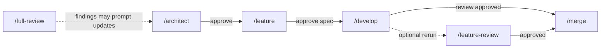
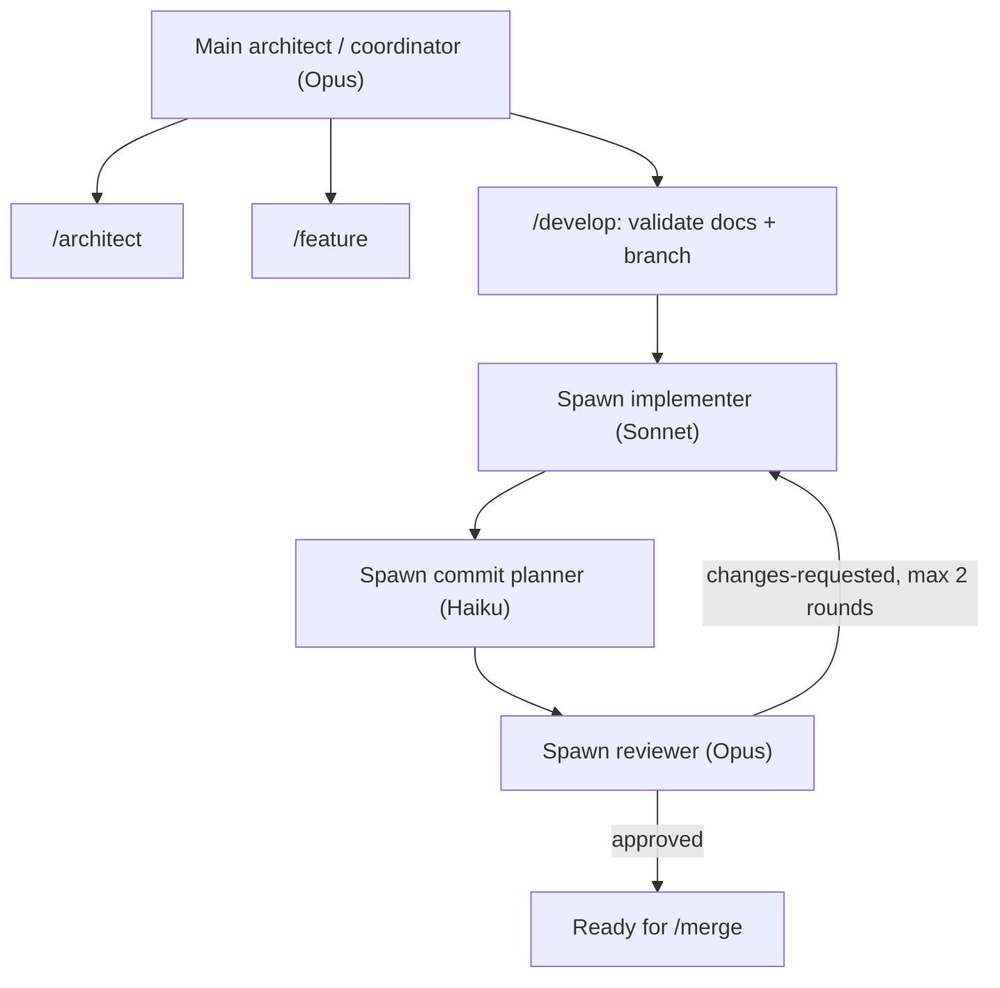

# Architecture: robodev

## Problem and context

AI-assisted development workflows often become too procedural: too many explicit commands, too much manual model switching, and too much repeated context setup for small features.

`robodev` solves that by defining a compact architect-led workflow with a shared command contract across tools and a richer Claude-specific execution layer under the hood.

Target audience: software architects who want agents to handle routine delivery work while preserving control over architecture, scope, and merge decisions.

## Goals and non-goals

**Goals**

- reduce feature overhead by collapsing micro-steps into a smaller command set
- preserve architect control through clear approval gates
- keep a shared workflow contract across Claude Code and Copilot
- make Claude the best-supported runtime through project subagents and model routing
- keep instructions concise and modular to avoid context bloat

**Non-goals**

- identical implementation mechanics across all tools
- fully autonomous architecture decisions by agents
- CI/CD orchestration or language-specific frameworks

## Asset model

`robodev` is a source of reusable workflow assets for target repositories.

- Shared workflow instructions and commands live in `skills/`.
- Claude-specific orchestration lives in project subagents installed into `.claude/agents/`.
- The shared docs contract stays tool-agnostic even when the Claude runtime is more capable.

This keeps one workflow language for the user while still allowing Claude to automate more of the delivery path.

## Primary command set

| Command | Purpose | Who uses it | Runtime behavior |
|---|---|---|---|
| `/architect` | Create or update `docs/architecture.md` from user stories | User | Inline |
| `/feature` | Create or switch to `feat/<name>` and write `docs/features/<name>.md` | User | Inline |
| `/develop` | Deliver the feature by orchestrating tests, implementation, commits, and review | User | Claude: subagent orchestration; Copilot: sequential single-thread flow |
| `/merge` | Merge an approved feature branch into `main` and clean up temporary feature docs | User | Inline |
| `/feature-review` | Optional standalone rerun of the feature reviewer | User | Read-only review |
| `/full-review` | Periodic whole-codebase audit | User | Read-only review |

## Development cycle



1. **`/architect`** — asks clarifying questions, then writes or updates the architecture doc. Gate: architect approves.
2. **`/feature`** — creates or switches to `feat/<name>` from `main`, then writes the feature spec with acceptance criteria and a test plan. Gate: architect approves the spec.
3. **`/develop`** — main delivery command.
   - The main architect process reads the approved architecture and feature spec.
   - The architect decides the execution order and spawns subagents at the points defined below.
   - The architect collects outputs, handles approval logic, and loops workers when needed.
   - The command stops with `[BLOCKED]` or `[ARCH CHANGE NEEDED]` instead of silently expanding scope.
4. **`/feature-review`** — optional standalone review pass when the architect wants an independent rerun before merge.
5. **`/merge`** — merges the approved feature branch into `main` with a merge commit, removes `docs/features/<name>.md` and `docs/reviews/<name>.md` in that merge commit, and deletes the local feature branch.
6. **`/full-review`** — periodic architecture audit of the whole codebase. Findings may prompt the architect to update `docs/architecture.md` or create new feature work.

## Tool-specific behavior

### Claude Code

Claude is the first-class runtime.

#### Main-thread architect

The main Claude process is the **architect/coordinator**. It is the only long-lived thread that talks directly to the user, owns the workflow state, and decides when to spawn subagents.

Model policy:

- **Architect/coordinator** — **Opus**
- **Feature authoring** — **Opus**
- **Implementation** — **Sonnet**
- **Commit planning** — **Haiku**
- **Review** — **Opus**

This keeps the highest-judgment work on Opus, uses Sonnet for the heavy coding path, and pushes low-risk commit grouping to Haiku.

#### Subagent lifecycle

The main architect process spawns subagents only when work benefits from context isolation or cheaper routing.

1. **`/architect`**
   - Runs in the main **Opus** thread.
   - No worker is required by default because this step is short, user-facing, and architecture-sensitive.

2. **`/feature`**
   - Runs in the main **Opus** thread.
   - No worker is required by default because acceptance criteria and test plans should be authored in the highest-judgment context.

3. **`/develop`**
   - Step 1: the main **Opus** architect validates prerequisites:
     - `docs/architecture.md` exists (always current; human-owned)
     - `docs/features/<name>.md` exists with `Status: draft` (approved by the architect)
     - active `feat/<name>` branch
   - Step 2: the architect prepares a delivery plan from the approved docs.
   - Step 3: the architect spawns the **implementer** on **Sonnet**.
     - The implementer writes or updates tests from the feature test plan.
     - The implementer changes production code until the acceptance criteria are satisfied or a blocker is found.
   - Step 4: once the working tree reflects the intended change, the architect spawns the **commit planner** on **Haiku**.
     - The commit planner inspects the diff.
     - It proposes atomic commit groups and conventional commit messages.
     - The architect approves, then the commit planner creates the commits.
   - Step 5: after commits are created, the architect spawns the **reviewer** on **Opus**.
     - The reviewer compares the committed diff against the feature spec.
     - The reviewer checks acceptance criteria, test coverage, and overall merge readiness.
     - The reviewer writes `docs/reviews/<name>.md`.
   - Step 6: if the reviewer returns `changes-requested`, the architect loops back to the **Sonnet** implementer with the review findings, then reruns the **Opus** reviewer. Maximum 2 review rounds; if issues remain after the second round, the architect stops with `[BLOCKED]`.



4. **`/merge`**
   - Returns to the main **Opus** architect thread.
   - No subagent is required by default because merge approval, branch checks, and final integration are architect-controlled operations.
   - The architect verifies the feature is approved, confirms the branch is merge-ready, and performs the guarded merge into `main`.

5. **`/feature-review`**
   - Runs the **Opus** reviewer directly as a standalone re-review pass.

6. **`/full-review`**
   - Runs the **Opus** reviewer directly for whole-codebase auditing.

The user still sees one delivery command, but the internal work is split across isolated contexts so manual model switching and context clearing are no longer part of the workflow.

### GitHub Copilot CLI

Copilot keeps the same high-level workflow and document contract, but without project subagents or model routing.

`/develop` performs the same phases sequentially in a single thread: implementation (tests + production code), commit planning, and review. All phases run on whatever model the Copilot session is using.

`/merge` still runs as an explicit guarded step so final integration stays under direct architect control.

## Example flow

```bash
> /architect
# architect reviews docs/architecture.md
> /feature user-auth
# architect reviews docs/features/user-auth.md
> /develop user-auth
# architect reviews docs/reviews/user-auth.md
> /merge user-auth
```

## Constraints

1. **Agents do not make architectural decisions** — flag ambiguity with `[BLOCKED]` or `[ARCH CHANGE NEEDED]` and wait.
2. **Dedicated feature branches** — feature work happens on `feat/<name>`, never directly on `main`.
3. **Atomic conventional commits** — delivery still produces reviewable commits even when commit planning is internal to `/develop`.
4. **Review before merge** — review is mandatory, but it does not need to be a separate user-facing step.
5. **No silent scope expansion** — no new dependencies, modules, or behavior unless allowed by the approved design.
6. **Concise documents** — no filler, no placeholders, no duplicated workflow logic when avoidable.
7. **Mermaid only** for diagrams.
