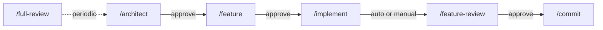

# Architecture: robodev

## Problem and context

Developers using AI coding agents face prompt/configuration drift between tools and
lack a repeatable workflow keeping the human architect in control. This template
provides a single-source-of-truth setup using the [Agent Skills](https://agentskills.io)
open standard so teams can switch agents without duplicating instructions.

Target audience: software architects steering AI agents through a phased workflow
(spec → plan → implement → review) with reviewable, atomic increments.

## Goals and non-goals

**Goals:** single source of truth via Agent Skills standard; phased workflow with
architect gates; tool-agnostic (Claude Code CLI, Copilot CLI, any Agent Skills
compatible tool); minimal context to avoid token bloat.

**Non-goals:** not a framework/runtime — static template only; no CI/CD; language-agnostic.

## Repository structure

```
robodev/
├── skills/                                      # Tool-agnostic skill sources
│   ├── instructions.md                          # Project instructions template
│   ├── architect/SKILL.md
│   ├── feature/SKILL.md + template.md
│   ├── implement/SKILL.md
│   ├── feature-review/SKILL.md
│   ├── full-review/SKILL.md
│   └── commit/SKILL.md
├── docs/
│   ├── architecture.md                          # This document
│   ├── features/                                # Feature design docs
│   └── internal/user_stories.md                 # Requirements
└── README.md
```

This repo is a **source of reusable workflow skills**, not a target project.
Skills live in a neutral `skills/` folder — not in `.claude/` or `.github/` —
because they aren't tied to any specific tool.

An installer script (future) copies skills into a target project's tool-specific
locations (e.g., `.claude/skills/`, `.github/copilot-instructions.md`).

## Skill inventory

| Skill | Purpose | Invocation | Context |
|---|---|---|---|
| `/architect` | Create/update `docs/architecture.md` from user stories | User-only | Inline |
| `/feature` | Design a feature into `docs/features/<name>.md` | User-only | Inline |
| `/implement` | Implement a feature design as code + tests | User-only | Inline |
| `/feature-review` | Review branch diff vs `main` | Both | Fork (Explore subagent) |
| `/full-review` | Audit full codebase, score on 5 KPIs | Both | Fork (Explore subagent) |
| `/commit` | Stage and commit with conventional messages | User-only | Inline |

Code-changing skills require explicit user invocation. Review skills run in forked
subagents (read-only, isolated context) enabling cross-agent review — a different
model reviews than the one that authored the code.

## Development cycle



1. **`/architect`** — agent asks clarifying questions, produces architecture doc. Gate: architect approves.
2. **`/feature`** — agent designs one feature, produces design doc. Gate: architect approves. Flags `[ARCH CHANGE NEEDED]` if architecture needs updating.
3. **`/implement`** — agent reads architecture + design doc, proposes numbered plan at commit granularity. Gate: architect approves plan, then each step. Agent stops with `[BLOCKED]` on conflicts.
4. **`/feature-review`** — forked subagent reviews branch diff. Output: Critical issues + Suggestions. Gate: address criticals before merge.
5. **`/commit`** — agent groups changes into atomic conventional commits (`type(scope): description`). Gate: architect approves before execution.
6. **`/full-review`** (periodic) — forked subagent scores codebase on 5 KPIs, produces `docs/review.md`.

### Example flow

```bash
git checkout -b feat/user-auth
> /feature add JWT-based user authentication   # design
# architect reviews docs/features/user-auth.md
> /implement docs/features/user-auth.md        # implement
> /feature-review                              # review (use different agent if possible)
> /commit                                      # commit
```

## Constraints

1. **Agents do not make architectural decisions** — flag with `[BLOCKED]` or `[ARCH CHANGE NEEDED]` and wait.
2. **Atomic conventional commits** — `type(scope): description`.
3. **No new dependencies** unless in the design doc.
4. **Concise documents** — no filler, no "TBD", no placeholders.
5. **Mermaid only** for diagrams.
6. **Cross-agent review** when practical.

## Open questions

- Installer script design: copy files, or symlink from a cloned robodev into the target project?
- How to handle agent-specific settings with no cross-tool equivalent (e.g., `.claude/settings.json`)?
- Should the installer also scaffold `docs/` structure in the target project?
