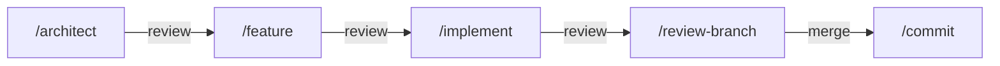

# Architecture: robodev

## Problem and context

Developers using AI coding agents (Claude Code, GitHub Copilot CLI) face two problems:
prompt and configuration drift between tools, and lack of a repeatable workflow
that keeps the human architect in control. This template provides a single-source-of-truth
setup so teams can switch between agents without duplicating instructions or losing
consistency.

Target audience: software architects who steer AI agents through a phased workflow
(spec → plan → implement → review) and want reviewable, atomic increments.

## Goals and non-goals

### Goals

1. **Single source of truth** — every skill and instruction is defined once using the
   [Agent Skills](https://agentskills.io) open standard, readable by any compatible tool.
2. **Phased workflow** — enforce spec → plan → implement → review gates so the architect
   validates at each stage.
3. **Tool-agnostic** — support Claude Code CLI and GitHub Copilot CLI today; adding
   another agent requires no new content — only Agent Skills compatibility.
4. **Minimal context** — keep project instructions and skills concise so agents
   get focused context without token bloat.

### Non-goals

- Building a framework or runtime — this is a static template of files and conventions.
- Automating CI/CD pipelines — out of scope; this covers the local dev workflow only.
- Prescribing a tech stack for target projects — the template is language-agnostic.

## Skills, not commands

This template uses **skills** (`.claude/skills/<name>/SKILL.md`), not legacy commands
(`.claude/commands/<name>.md`). The distinction matters:

| Aspect | Commands (legacy) | Skills (adopted) |
|---|---|---|
| Format | Single `.md` file | Directory with `SKILL.md` + supporting files |
| Standard | Claude Code proprietary | [Agent Skills](https://agentskills.io) open standard |
| Cross-tool | Requires symlinks per tool | Native discovery by any compatible agent |
| Invocation control | Always user-invoked | Configurable: user-only, agent-only, or both |
| Subagent support | No | `context: fork` runs in isolated subagent |
| Supporting files | No | Templates, scripts, examples alongside `SKILL.md` |

Skills follow the Agent Skills open standard — maintained by Anthropic, adopted by
GitHub Copilot and other tools. Both Claude Code and Copilot CLI discover skills in
`.claude/skills/` natively, so **no symlinks are needed for skills**.

## Repository structure

```
robodev/
├── CLAUDE.md                                    # ① Project instructions (canonical)
├── .claude/
│   └── skills/                                  # ② Agent Skills (open standard)
│       ├── architect/
│       │   └── SKILL.md
│       ├── commit/
│       │   └── SKILL.md
│       ├── feature/
│       │   ├── SKILL.md
│       │   └── template.md                      #    Feature doc template
│       ├── implement/
│       │   └── SKILL.md
│       ├── review/
│       │   └── SKILL.md
│       └── review-branch/
│           └── SKILL.md
├── .github/
│   └── copilot-instructions.md  → ../CLAUDE.md  # ③ Symlink (only one needed)
├── docs/
│   ├── architecture.md                          # This document
│   ├── features/                                # Feature design docs (one per feature)
│   └── internal/
│       └── user_stories.md                      # Requirements
└── README.md
```

### Key directories

| Directory | Purpose | Consumed by |
|---|---|---|
| `.claude/skills/` | Workflow skills (Agent Skills standard) | Claude Code, Copilot CLI — both discover natively |
| `docs/features/` | Feature design documents | Agents during `/implement` |
| `docs/internal/` | Requirements, user stories | Agents during `/architect` and `/feature` |

## Shared content strategy (DRY)

### Project instructions — symlink

| Tool | File read | Strategy |
|---|---|---|
| Claude Code | `CLAUDE.md` | Canonical — edit here |
| Copilot CLI / VS Code | `.github/copilot-instructions.md` | Symlink → `../CLAUDE.md` |

Both serve the same purpose: always-on project context loaded at session start.
This is the only symlink required.

```bash
mkdir -p .github
ln -s ../CLAUDE.md .github/copilot-instructions.md
```

### Skills — no symlinks needed

Skills live in `.claude/skills/` following the Agent Skills open standard. Both Claude
Code and Copilot CLI discover them from this location. No duplication, no symlinks.

Each skill is a directory with at minimum a `SKILL.md`. Supporting files (templates,
scripts, examples) live alongside it and are loaded on demand:

```
feature/
├── SKILL.md           # Main instructions (required)
├── template.md        # Feature doc template Claude fills in
└── examples/
    └── sample.md      # Example output showing expected format
```

## Skill design

### Invocation control

Not every skill should be invocable the same way. The `disable-model-invocation`
and `user-invocable` frontmatter fields control this:

| Skill | Invocation | Rationale |
|---|---|---|
| `architect` | User-only (`disable-model-invocation: true`) | Architect decides when to start design |
| `feature` | User-only | Architect decides which feature to design |
| `implement` | User-only | Architect approves plan before code |
| `commit` | User-only | Agent must not auto-commit |
| `review` | Both (default) | Agent may suggest a review when relevant |
| `review-branch` | Both (default) | Agent may offer to review after implementation |

### Subagent execution

Skills that benefit from isolation use `context: fork` to run in a subagent.
This keeps the main conversation clean and prevents context pollution:

| Skill | Context | Agent type | Rationale |
|---|---|---|---|
| `review` | `fork` | `Explore` | Read-only analysis, no side effects |
| `review-branch` | `fork` | `Explore` | Read-only diff analysis |
| `architect` | inline | — | Needs conversation history for Q&A |
| `implement` | inline | — | Needs iterative approval loop |

### Frontmatter conventions

All skills in this template use these frontmatter fields from the Agent Skills standard:

```yaml
---
name: skill-name                     # Required: lowercase, hyphens only
description: What and when           # Required: max 1024 chars
argument-hint: [files or context]    # Optional: autocomplete hint
disable-model-invocation: true       # Optional: user-only invocation
context: fork                        # Optional: run in subagent
agent: Explore                       # Optional: subagent type
allowed-tools: Read Grep Glob        # Optional: tool restrictions
---
```

## Tool configuration

### Claude Code CLI

| Concept | Location | Notes |
|---|---|---|
| Project instructions | `CLAUDE.md` | Auto-loaded every session |
| Skills | `.claude/skills/<name>/SKILL.md` | Invoked as `/skill-name` |
| Settings (shared) | `.claude/settings.json` | Tool permissions, model preferences |
| Settings (personal) | `.claude/settings.local.json` | Git-ignored; per-developer overrides |

### GitHub Copilot CLI

| Concept | Location | Notes |
|---|---|---|
| Project instructions | `.github/copilot-instructions.md` | Symlink to `CLAUDE.md` |
| Skills | `.claude/skills/<name>/SKILL.md` | Discovered natively via Agent Skills standard |
| Path-scoped rules | `.github/instructions/*.instructions.md` | Optional; for language-specific guidance |

## Workflow

The workflow maps to skills. Each phase has a gate where the architect reviews
before proceeding.



| Phase | Skill | Input | Output | Gate |
|---|---|---|---|---|
| **Spec** | `/architect` | User stories, context | `docs/architecture.md` | Architect approves architecture |
| **Design** | `/feature` | Architecture doc + feature request | `docs/features/<name>.md` | Architect approves design |
| **Implement** | `/implement` | Architecture + feature design | Code + tests | Architect approves plan, then each step |
| **Review** | `/review-branch` | Branch diff vs `main` | Actionable findings | Architect addresses critical items |
| **Commit** | `/commit` | Staged changes | Atomic conventional commits | Architect approves message(s) |
| **Audit** | `/review` | Full codebase | Scored KPI report in `docs/review.md` | Periodic health check |

### Model selection

Use lighter models for low-risk tasks to control cost:

| Task | Suggested tier | Examples |
|---|---|---|
| Architecture, design | High | Claude Opus, GPT-4o |
| Implementation | Standard | Claude Sonnet, GPT-4.1 |
| Commits, formatting | Fast | Claude Haiku, GPT-4.1-mini |

## Constraints and conventions

1. **Agents do not make architectural decisions.** They flag conflicts with
   `[BLOCKED: ...]` or `[ARCH CHANGE NEEDED: ...]` and wait for the architect.
2. **Atomic commits.** Each commit is one logical change, using conventional commit
   format: `type(scope): description`.
3. **No new dependencies** unless explicitly listed in the design doc.
4. **Documents are concise.** No filler, no "TBD", no placeholders. Every bullet is
   actionable or informative.
5. **Mermaid only** for diagrams — no external images.
6. **Cross-agent review.** When practical, use a different agent to review than the one
   that authored the code.

## Open questions

- Should `.github/instructions/*.instructions.md` (path-scoped Copilot rules) also
  be sourced from a canonical location, or are they Copilot-specific enough to live
  only in `.github/`?
- How to handle agent-specific settings that have no cross-tool equivalent
  (e.g., `.claude/settings.json` tool permissions)?
- Should the template include a bootstrap script to create the
  `.github/copilot-instructions.md` symlink on clone?
